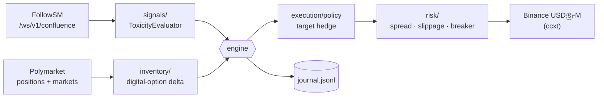
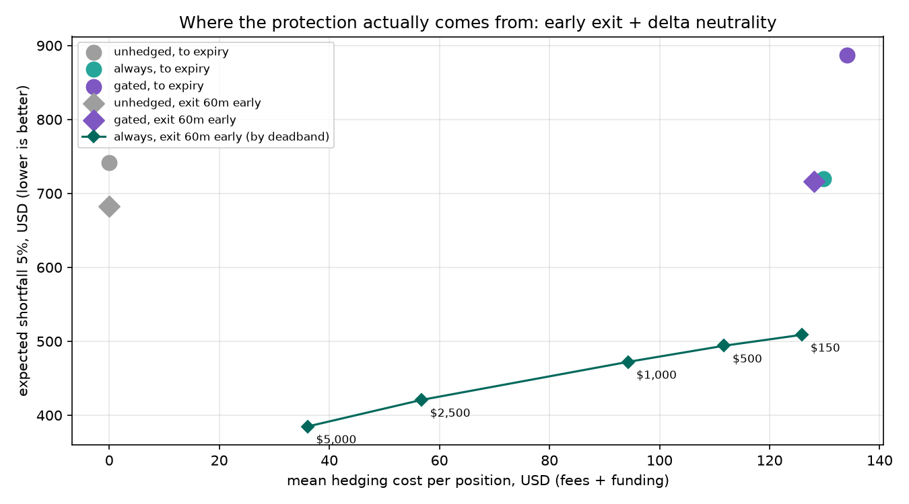

# Dynamic Inventory Hedger

[](https://pypi.org/project/followsm-sdk/)
[](https://colab.research.google.com/github/Follow-SM/dynamic-inventory-hedger/blob/main/quickstart.ipynb)
[](https://follow-sm.com/pricing)
[](LICENSE)

This tool delta-hedges **Polymarket crypto positions** with **Binance USDⓈ-M perpetual futures**. How hard it hedges depends on [FollowSM](https://follow-sm.com) microstructure toxicity: VPIN percentile, orderbook imbalance, liquidity sweeps and smart-money flow.

A Polymarket "Bitcoin above $84,000 on Friday" position is really a digital option on BTC. When informed flow hits the market, that position moves before any stop-loss can react. The hedger turns each position into an equivalent perp exposure and then:

- **stays unhedged** while the flow is normal;
- **builds a hedge with post-only limit orders** when toxicity rises;
- **neutralises its exposure with price-protected IOC orders** when toxicity spikes or a liquidity sweep hits;
- **unwinds the hedge** once the flow normalises.

It runs in **paper mode** by default.

> **Read the [backtest](#honest-backtest--methodology) before relying on toxicity gating.** On 256 daily BTC markets (Jan–Sep 2026), gating on VPIN rebuilt from public 1-minute data did no better than the same hedges at random times. What did cut the tail was staying delta-neutral all the time and exiting an hour before resolution.

---

## How it works



| Layer | Module | Responsibility |
|---|---|---|
| Schemas | `models.py` | `PositionState`, `ToxicityMetric`, `HedgeSignal` |
| Signals | `signals/consumer.py`, `signals/evaluator.py` | FollowSM WebSocket (or REST polling) → toxicity level with hysteresis |
| Inventory | `inventory/polymarket.py`, `inventory/delta.py` | Polymarket positions → equivalent perp notional per underlying |
| Execution | `execution/policy.py`, `execution/drivers.py` | Target hedge, adaptive limit slicing, IOC sweeps; paper and Binance drivers |
| Risk | `risk/controls.py` | Spread and slippage protection, failure circuit breaker, JSONL journal |

### 1. Toxicity bands

The bands use `vpin_percentile`, which ranks VPIN against the symbol's own recent history. Raw VPIN levels differ widely between pairs, so a single raw threshold can't serve BTC and a thin altcoin alike. While a symbol is still warming up and has no percentile, the evaluator falls back to high raw-VPIN thresholds that only catch extreme readings.

| Level | Trigger (defaults) | Hedge ratio | Order style |
|---|---|---|---|
| `EMERGENCY_HEDGE_EXECUTION` | `vpin_percentile ≥ 0.95`, **or** a liquidity sweep (volume Z ≥ 6 and a 15-minute move ≥ 2 × NATR), **or** a PRE condition confirmed by ≥ $250k smart-money sweeps with ≥ 65% of Polymarket book flow against you | 100% | IOC limit at mid ± 15 bps |
| `PRE_HEDGING_ALERT` | `vpin_percentile ≥ 0.85`, **or** `ob_toxicity_1pct > 2` (lopsided 1% book) | 50% | Post-only limit at the touch, in $2k slices |
| `NORMAL` | everything below `vpin_percentile 0.60` (hysteresis) | 0% | Post-only, reduce-only unwind |

The evaluator escalates immediately, steps down from EMERGENCY to PRE once the emergency trigger clears, and returns to NORMAL only when every signal is back under the rebalance band. This stops it flip-flopping around a threshold.

### 2. Polymarket position → perp delta

Polymarket's crypto price markets resolve on the Binance BTC/USDT close, which is the same price the hedge trades. Each position is therefore priced as a zero-drift digital option, and the hedge is the resulting delta in USD. `delta_usd` is the P&L of a +100% log move, i.e. the perp notional with the same first-order exposure.

| Market type | Example | YES price | Sensitivity dP/d ln S |
|---|---|---|---|
| above | "Will Bitcoin be above $84,000 on Friday?" | N(d) | φ(d) / σ |
| below | "…below $80,000…" | N(−d) | −φ(d) / σ |
| up / down | "Bitcoin Up or Down – 6AM ET" | "above" with K = the window's opening candle | 0 until the window opens |
| reach | "Will ETH reach $4,000…" | ≈ 2·N(−ln(K/S)/σ) (one-touch) | 2·φ(ln(K/S)/σ) / σ |
| dip to | "Will BTC dip to $70k…" | ≈ 2·N(−ln(S/K)/σ) (one-touch) | −2·φ(ln(S/K)/σ) / σ |

Here d = (ln(S/K) − σ²/2) / σ, and σ is the volatility over the time to expiry. It comes from FollowSM's `natr_15m`: for Brownian motion the expected range is about 1.596·σ, so σ₁₅ₘ ≈ `natr_15m` / 1.596, scaled by √(τ / 15 min).

Two safety rules apply:
- **Final minutes:** a digital option's delta blows up at the money just before expiry, and a perp hedge there churns far more than it protects. So delta is **zeroed in the last 5 minutes** (`NO_HEDGE_FINAL_SECS`).
- **Per-position cap:** delta is capped at `MAX_DELTA_PER_POSITION_USD`.

Markets the model can't price, such as Fed decisions or ETF approvals, are skipped unless you give them a manual beta in `MANUAL_MARKETS_FILE` (see [examples/manual_markets.example.json](examples/manual_markets.example.json)):

```json
{ "fed-decision-in-october": { "underlying": "BTCUSDT", "beta_pp_per_pct": 0.8 } }
```

(`0.8` = the YES price gains 0.8 probability points per +1% move in BTC.)

### 3. Hedge policy and inventory limit

```text
target_hedge = −ratio(level) × polymarket_delta
imbalance    = (polymarket_delta + current_hedge) / MAX_INVENTORY_USD
```

The unhedged remainder may never exceed `MAX_INVENTORY_USD`, so a large enough position is partly hedged even in `NORMAL`. When the book is already over the limit, the hedger closes the gap with IOC orders. Target changes smaller than `MIN_REBALANCE_USD` are ignored.

### 4. Risk controls

- **Spread guard:** no order is sent while the perp spread is wider than `MAX_SPREAD_BPS`.
- **Slippage protection:** IOC orders are limit orders at mid ± `MAX_SLIPPAGE_BPS`, never plain market orders.
- **Failure circuit breaker:** after `MAX_CONSECUTIVE_FAILURES` consecutive failures (rate limits, exchange downtime), the hedger stops and exits with a non-zero code. A human has to look before it trades again.
- **Feed outage:** if the FollowSM stream drops, existing hedges are kept and no new orders are placed until data returns.
- **Journal:** every decision, refusal, error and order is appended to `JOURNAL_PATH` (JSONL). That is the paper-trading record, and it can be replayed later.

---

## Quickstart

```bash
git clone https://github.com/Follow-SM/dynamic-inventory-hedger.git
cd dynamic-inventory-hedger
python -m venv .venv && source .venv/bin/activate      # or: uv sync --extra dev
pip install -e ".[dev]"
cp .env.example .env                                    # set FOLLOWSM_API_KEY
python examples/polymarket_binance_hedge.py --minutes 5
```

Without `POLYMARKET_WALLET`, the example seeds a sample position in the live "Bitcoin above $K" market nearest the current price. You can watch the bands, delta and paper hedges on live data without a wallet or exchange keys. To track your real positions, set `POLYMARKET_WALLET` to the proxy wallet that holds them and run `dynamic-inventory-hedger`.

No Enterprise key? Set `SIGNAL_SOURCE=poll` to use REST snapshots on any tier (subject to its rate limit).

Tests, lint and type-check:

```bash
pytest -q && ruff check src tests && mypy src
```

### Going live

1. **Paper first.** Read the journal. Make sure the bands, deltas and order sizes are what you expect. Paper mode prices against the live Binance book but assumes post-only orders fill at the touch, which is optimistic, so real passive fills will be slower and partial.
2. **Binance demo trading.** Set `LIVE_TRADING=true` with demo API keys; `BINANCE_DEMO=true` is the default. Orders go to Binance's futures demo environment.
3. **Real money.** Only after that, set `BINANCE_DEMO=false`. Use an API key with futures trading enabled, **withdrawals disabled**, and an IP allow-list. The hedger trades one-way mode and never uses leverage settings you haven't set on the account.

### Configuration (`.env`)

| Variable | Default | Description |
|---|---|---|
| `FOLLOWSM_API_KEY` | | ENTERPRISE for `SIGNAL_SOURCE=stream`; any tier for `poll` |
| `SIGNAL_SOURCE` | `stream` | `stream` (WebSocket) or `poll` (REST) |
| `POLYMARKET_WALLET` | | Proxy wallet holding the conditional tokens |
| `MANUAL_MARKETS_FILE` | | JSON with per-market `underlying` + `beta_pp_per_pct` |
| `PRE_HEDGE_PERCENTILE` / `EMERGENCY_PERCENTILE` / `REBALANCE_PERCENTILE` | `0.85` / `0.95` / `0.60` | Toxicity bands on `vpin_percentile` |
| `PRE_HEDGE_RAW_VPIN` / `EMERGENCY_RAW_VPIN` / `REBALANCE_RAW_VPIN` | `0.80` / `0.90` / `0.60` | Fallback while `vpin_percentile` is warming up |
| `OB_TOXICITY_THRESHOLD` | `2.0` | 1% book ask/bid notional ratio treated as toxic |
| `SWEEP_VOLUME_Z` / `SWEEP_MOVE_NATR` | `6.0` / `2.0` | Liquidity-sweep definition |
| `WHALE_SWEEPS_ESCALATE_USD` / `ADVERSE_FLOW_ESCALATE` | `250000` / `0.65` | Smart-money escalation from PRE to EMERGENCY |
| `BASELINE_HEDGE_RATIO` / `PRE_HEDGE_RATIO` / `EMERGENCY_HEDGE_RATIO` | `0` / `0.5` / `1.0` | Share of delta hedged per level |
| `MAX_INVENTORY_USD` | `25000` | Hard limit on unhedged delta per underlying |
| `MIN_REBALANCE_USD` / `PASSIVE_SLICE_USD` | `150` / `2000` | Rebalance deadband; passive slice size |
| `MAX_DELTA_PER_POSITION_USD` / `NO_HEDGE_FINAL_SECS` | `50000` / `300` | Delta-model safety caps |
| `MAX_SLIPPAGE_BPS` / `MAX_SPREAD_BPS` / `MAX_CONSECUTIVE_FAILURES` | `15` / `25` / `3` | Execution risk limits |
| `LIVE_TRADING` / `BINANCE_DEMO` | `false` / `true` | Paper → Binance demo → real |
| `BINANCE_API_KEY` / `BINANCE_API_SECRET` | | Required when `LIVE_TRADING=true` |
| `JOURNAL_PATH` | `hedger_journal.jsonl` | Decision and order log |

---

## Honest Backtest & Methodology

We backtested the hedger's own code paths (`ToxicityEvaluator` → `position_delta_usd` → `decide()`) on every daily Polymarket *"Will the price of Bitcoin be above $K on <date>?"* market from **2 January to 28 September 2026**. The goal was to find out whether toxicity gating actually cuts tail risk. **Mostly, it didn't.**

### Setup

- **Book.** At 24 hours before resolution, hold 1,000 shares of the strike nearest spot, once long YES and once long NO (mirrored books, so directional drift cancels). Hold to the official resolution. There are 256 markets (512 books); 8 were skipped because no strike was priced between 0.10 and 0.90 at entry.
- **Replay.** Minute by minute on real data:
  - Polymarket CLOB minute history for the marks;
  - Binance USDⓈ-M BTCUSDT perp minute closes for the hedge;
  - maker 2 bps (post-only, assumed filled within the minute) and taker 5 bps + 1 bp slippage (IOC);
  - real funding payments.
- **Signals.** This is our own open reimplementation from Binance public 1-minute spot klines, which carry the exact taker-buy notional per bar. It is **not** FollowSM's production calibration.
  - VPIN uses $1M notional buckets over a 50-bucket window. `vpin_percentile` is its rank within the previous 7 days.
  - A robustness run uses activity-scaled buckets (trailing 7-day average daily volume / 50).
  - Three inputs have no public history and were **not tested**: 1% book toxicity, smart-money sweeps, and Polymarket book flow. Only the VPIN-percentile and liquidity-sweep triggers are exercised.
- **Placebo.** This is the `gated` strategy with its level path shifted by a random offset (20 seeds). It hedges exactly as often, in regimes of the same length, at the wrong times. If the toxicity timing carries information, `gated` should beat it.

### Results (USD per 1,000-share position, $1M buckets)

| Strategy | Mean P&L | Std dev | Expected shortfall 5% | Worst | p95 drawdown | Hedge cost | Perp traded |
|---|---:|---:|---:|---:|---:|---:|---:|
| Unhedged, to expiry | 0 | 473 | −742 | −885 | 895 | 0 | 0 |
| Inventory limit only | −115 | 394 | −829 | −1,177 | 858 | 101 | $288k |
| **Toxicity-gated** (repo defaults) | −152 | 383 | −887 | −1,177 | 890 | 134 | $408k |
| **Placebo** (mean of 20 seeds) | −159 | 375 | −887 | −1,211 | 880 | 141 | $429k |
| Always 100% hedged | −130 | 242 | −719 | −1,020 | 723 | 130 | $649k |
| Unhedged, exit 1h early | 0 | 402 | −682 | −839 | 770 | 0 | 0 |
| Always hedged, exit 1h early | −127 | 171 | −509 | −776 | 594 | 126 | $610k |
| … with a $5,000 rebalance deadband | −38 | 164 | **−385** | −535 | 490 | 36 | $158k |

Mean P&L is 0 when unhedged because the YES and NO books mirror each other. Every hedged strategy's mean is simply minus its hedging cost.

**Findings:**

1. **The toxicity timing adds nothing measurable.** The placebo matched or beat `gated` on expected shortfall in 50% of seeds and on standard deviation in 95%. With activity-scaled buckets the figures were 55% and 95%. `gated` is roughly unhedged minus its costs.
2. **VPIN rebuilt from 1-minute klines did not flag tail moves.** With $1M buckets, a top-5% VPIN percentile was followed by a top-1% 15-minute BTC move **0.61×** as often as the base rate. With activity-scaled buckets it was **0.54×**. On the worst day in the sample, no alert fired at all with $1M buckets.
3. **The tail is mostly the jump at expiry.** Digital-option gamma explodes near resolution, and a perp hedge can't follow it. Staying fully delta-neutral and exiting an hour early roughly halved the 5% expected shortfall: −385 against −742 with the wider deadband. The cost fell from $126 to $36 per position once small rebalances were skipped.



### Caveats

- **Rebuilt signals only.** These are our reconstruction from public 1-minute bars, not FollowSM's tick-level production feed, and the order-book, smart-money and Polymarket-flow triggers are untested. This result says *"1-minute VPIN gating doesn't help"*, not *"microstructure gating can't help"*.
- **Narrow scope.** Only BTC at-the-money daily markets were tested, over nine months. The expected shortfall rests on the worst 25 of 512 books, so it is noisy.
- **In-sample deadband.** The grid was chosen in-sample, and the best value ($5,000) sits at its edge.
- **Optimistic fills and missing exit cost.** Post-only fills are assumed to be immediate. Leaving Polymarket an hour early is marked at the minute price, with no spread or slippage modelled for the exit.
- **Manual exit.** The hedger does not trade Polymarket, so the early exit is up to you.

### Reproduce

```bash
pip install -e ".[research]"
python research/backtest.py                    # $1M buckets -> research/results_fixed.json
VPIN_BUCKET=adv python research/backtest.py    # activity-scaled buckets -> research/results_adv.json
```

The first run downloads and caches about nine months of public Binance and Polymarket data under `research/data/`. No API keys are needed. Charts are written to [research/assets/](research/assets/).

To run the hedger the way the backtest favours, set `BASELINE_HEDGE_RATIO=1.0` (plus `PRE_HEDGE_RATIO=1.0` and `EMERGENCY_HEDGE_RATIO=1.0`) and a wider `MIN_REBALANCE_USD`, and close Polymarket positions yourself about an hour before resolution.

---

## Plans

| | Free | DEVELOPER ($199/mo) | **ENTERPRISE** ($499/mo) |
|---|---|---|---|
| REST requests/min | 30 (per IP) | 300 | 1,000 |
| **WebSocket `/ws/v1/confluence`** (`SIGNAL_SOURCE=stream`) | ❌ | ❌ | ✅ |

### 👉 [Get your API key at follow-sm.com/pricing](https://follow-sm.com/pricing)

## Related

- [`hft-toxicity-circuit-breaker`](https://github.com/Follow-SM/hft-toxicity-circuit-breaker): pull maker quotes on toxic flow
- [`polymarket-arbitrage-starter-kit`](https://github.com/Follow-SM/polymarket-arbitrage-starter-kit): quote Polymarket with the same risk ladder
- Python SDK: [`pip install followsm-sdk`](https://pypi.org/project/followsm-sdk/) · TypeScript: [`npm install @followsm/sdk`](https://www.npmjs.com/package/@followsm/sdk)

## Disclaimer

Educational software, MIT-licensed, provided as-is. Not financial advice. Hedging reduces some risks and adds others: basis between spot and the perp, funding payments, execution slippage, and model error in the delta mapping. Paper-trade and use Binance demo before risking capital, and check that prediction markets and perpetual futures are legal where you live.
